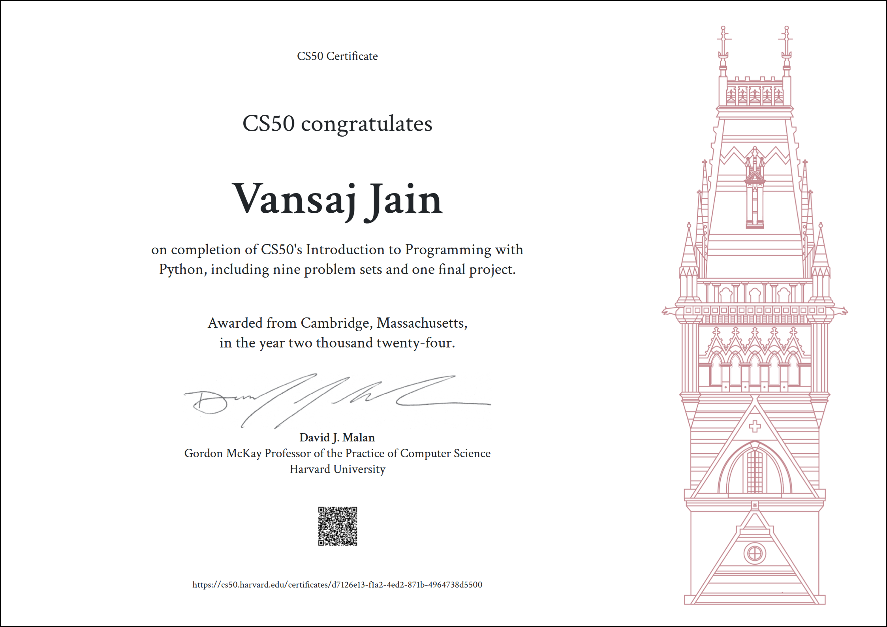

# CS50’s Introduction to Computer Science

**Course Link:-** [https://cs50.harvard.edu/python/2022/](https://cs50.harvard.edu/x/2025/)

## Problem Sets
### [Week 0 - Scratch](/Week%200/)
- [My Scratch Game](/Week%200/crab-ball-catch.sb3)

### [Week 1 - C](/Week%201/)
- [World](/Week%201/world)
- [Me](/Week%201/me)
- [Mario](/Week%201/mario-less)
- [Credit](/Week%201/credit)

### [Week 2 - Arrays](/Week%202/)
- [Scrabble](/Week%202/scrabble)
- [Readability](/Week%202/readability)
- [Substitution](/Week%202/substitution)

### [Week 3 - Algorithms](/Week%203/)
- [Sort](/Week%203/sort)
- [Plurality](/Week%203/plurality)
- [Runoff](/Week%203/runoff)

### [Week 4 - Memory](/Week%204/)
- [Volume](/Week%204/volume)
- [Filter - more](/Week%204/filter-more)
- [Recover](/Week%204/recover)

### [Week 5 - Data Structures](/Week%205/)
- [Inheritance](/Week%205/inheritance)
- [Speller](/Week%205/speller)

### [Week 6 - Python](/Week%206/)
- [Hello](/Week%206/sentimental-hello)
- [Mario-more](/Week%206/sentimental-mario-more)
- [Credit](/Week%206/sentimental-credit)
- [Readability](/Week%206/sentimental-readability)
- [DNA](/Week%206/dna)

### [Week 7 - SQL](/Week%207/)
- [Songs](/Week%207/songs)
- [Movies](/Week%207/movies)
- [Fiftyville](/Week%207/fiftyville)

### [Week 8 - HTML, CSS, JavaScript](/Week%208/)
- [Trivia](/Week%208/trivia)
- [Homepage](/Week%208/homepage)

## Final Project
- Title: Expense Mate
- Description: The Expense Mate is a web-based application that allows users to manage their income and expenses efficiently.
- Link:- [Expense Mate](https://github.com/vansaj0701/Expense-Mate)

## Academic Honesty
The essence of all work that you submit to this course must be your own. Unless otherwise specified, collaboration on assessments (e.g., assignments, labs, problem sets, projects, quizzes, or tests) is not permitted except to the extent that you may ask classmates and others for help so long as that help does not reduce to another doing your work for you. Generally speaking, when asking for help, you may show your work to others, but you may not view theirs, so long as you and they respect this policy’s other constraints.

> This solution is intended for reference only. Do not copy any code; otherwise, there is no point in doing this course.

## Acknowledgments
I would like to express my sincere gratitude to Professor David Malan and the entire CS50 team for creating such an exceptional learning experience. Special thanks to Harvard University for offering this course and making high-quality education accessible.
