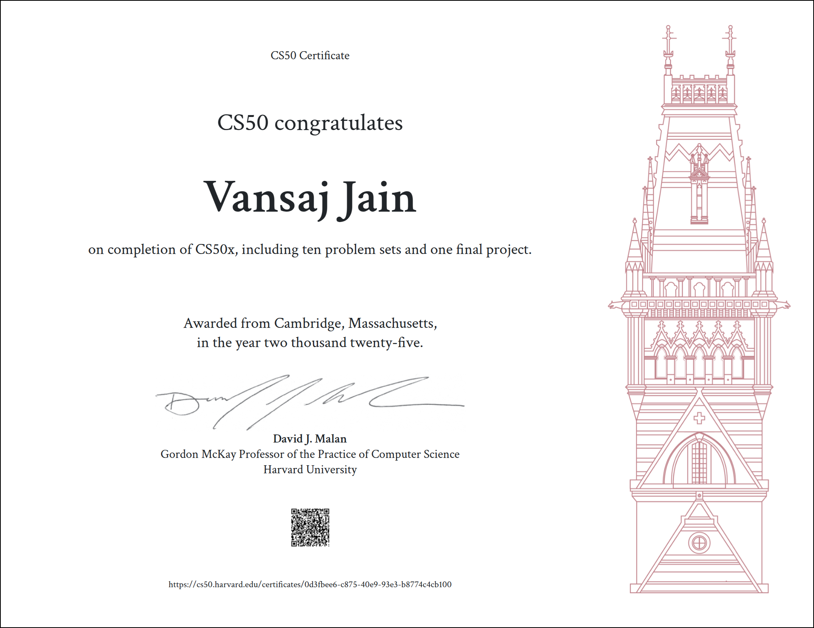

# CS50’s Introduction to Programming with Python

**Course Link:-** https://cs50.harvard.edu/python/2022/

## Problem Sets
### [Week 0 - Functions, Variables](/Week%200/)
- [Indoor Voice](/Week%200/indoor.py)
- [Playback Speed](/Week%200/playback/)
- [Making Faces](/Week%200/faces)
- [Einstein](/Week%200/einstein)
- [Tip Calculator](/Week%200/tip)

### [Week 1 - Conditionals](/Week%201/)
- [Deep Thought](/Week%201/deep)
- [Home Federal Savings Bank](/Week%201/bank)
- [File Extensions](/Week%201/extensions)
- [Math Interpreter](/Week%201/interpreter)
- [Meal Time](/Week%201/meal)

### [Week 2 - Loops](/Week%202/)
- [camelCase](/Week%202/camel)
- [Coke Machine](/Week%202/coke)
- [Just setting up my twttr](/Week%202/twttr)
- [Vanity Plates](/Week%202/plates)
- [Nutrition Facts](/Week%202/nutrition)

### [Week 3 - Exceptions](/Week%203/)
- [Fuel Gauge](/Week%203/fuel)
- [Felipe's Taqueria](/Week%203/taqueria)
- [Grocery List](/Week%203/grocery)
- [Outdated](/Week%203/outdated)

### [Week 4 - Libraries](/Week%204/)
- [Emojize](/Week%204/emojize)
- [Frank, Ian and Glen's Letters](/Week%204/figlet)
- [Adieu, Adieu](/Week%204/adieu)
- [Guessing Game](/Week%204/game)
- [Little Professor](/Week%204/professor)
- [Bitcoin Price Index](/Week%204/bitcoin)

### [Week 5 - Unit Tests](/Week%205/)
- [Testing my twttr](/Week%205/test_twttr)
- [Back to the Bank](/Week%205/test_bank)
- [Re-requesting a Vanity Plate](/Week%205/test_plates)
- [Refueling](/Week%205/test_fuel)

### [Week 6 - File I/O](/Week%206/)
- [Lines of Code](/Week%206/lines)
- [Pizza Py](/Week%206/pizza)
- [Scourgify](/Week%206/scourgify)
- [CS50 P-Shirt](/Week%206/shirt)

### [Week 7 - Regular Expressions](/Week%207/)
- [NUMB3RS](/Week%207/numb3rs)
- [Watch on YouTube](/Week%207/watch)
- [Working 9 to 5](/Week%207/working)
- [Regular, um, Expressions](/Week%207/um)
- [Response Validation](/Week%207/response)

### [Week 8 - Object-Oriented Programming](/Week%208/)
- [Seasons of Love](/Week%208/seasons)
- [Cookie Jar](/Week%208/jar)
- [CS50 Shirtificate](/Week%208/shirtificate)

## Final Project
- Title: Poetry Explorer
- Description: Poetry Explorer is a Python-based interactive application that lets you dive into the world of poetry using the PoetryDB API
- Link:- [Poetry Explorer](https://github.com/vansaj0701/Poetry-Explorer)
- Demo Video: https://youtu.be/s-Q0tJ6UDks

## Academic Honesty
The essence of all work that you submit to this course must be your own. Unless otherwise specified, collaboration on assessments (e.g., assignments, labs, problem sets, projects, quizzes, or tests) is not permitted except to the extent that you may ask classmates and others for help so long as that help does not reduce to another doing your work for you. Generally speaking, when asking for help, you may show your work to others, but you may not view theirs, so long as you and they respect this policy’s other constraints.

> This solution is intended for reference only. Do not copy any code; otherwise, there is no point in doing this course.

## Acknowledgments
I would like to express my sincere gratitude to Professor David Malan and the entire CS50 team for creating such an exceptional learning experience. Special thanks to Harvard University for offering this course and making high-quality education accessible.
